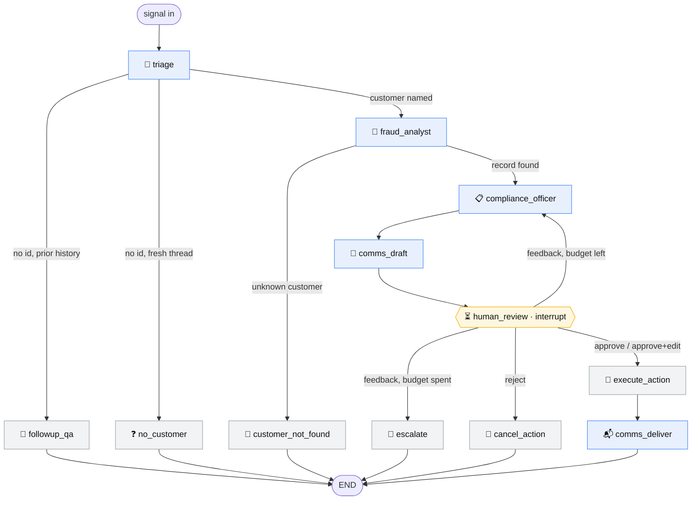
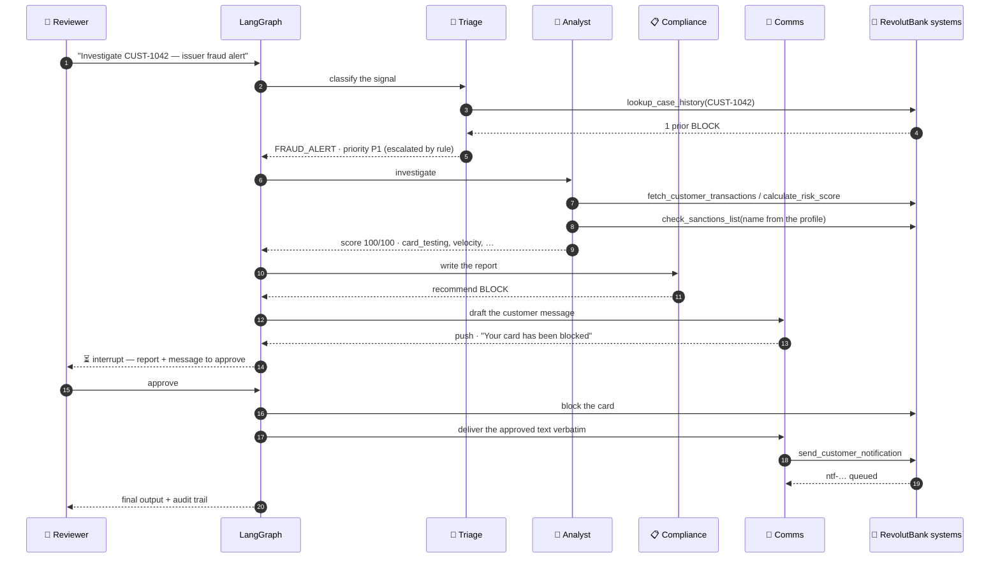

# 🏦 RevolutBank Fraud Operations — Multi-Agent LangGraph Workflow

**SoftUni · AI Agents and Workflows for Developers — Individual Project**

> *RevolutBank is a fictional bank invented for this educational project. No affiliation
> with Revolut Ltd.*

A **four-agent** LangGraph system that works a fraud signal end to end for a digital-first
retail bank — and **pauses for human approval** before it does anything the customer can
see.

## How to run it

**Google Colab** — this is the whole procedure:

1. Upload `Fraud_Detection_Multi_Agent.ipynb` (File → Upload notebook).
2. Open the 🔑 **Secrets** panel, add `ANTHROPIC_API_KEY`, enable *Notebook access*.
3. **Runtime → Run all.**

Nothing else. No Drive mount, no second install cell, no cell that waits for you to type,
no secret other than the API key. Every optional dependency has a working fallback, and the
human-in-the-loop decisions in the test cells are scripted, so the notebook completes
unattended. Ten tests in [test_colab_runall.py](tests/test_colab_runall.py) fail if a later
change breaks any of that.

**VS Code / local Jupyter:**

```bash
pip install -r requirements-dev.txt
cp .env.example .env        # then put your real key in .env
```

Then open the notebook, or open `fraud_multi_agent.py` — the same content in jupytext
*percent* format, so VS Code renders it as interactive cells (`# %%`) with no Jupyter
server. `get_secret()` tries Colab Secrets, then `.env`, then plain environment variables.
**No key is ever written in code.**

## Scenario

RevolutBank's Fraud Operations desk receives natural-language signals — issuer fraud
alerts, chargeback disputes, AML referrals, customer reports:

*"Investigate CUST-1042 — we received a fraud alert from the issuer."*

It has since been reviewed against current agent-harness practice; what that review found
and what changed is in [hareness_improvment.md](hareness_improvment.md).

| # | Agent | Responsibility |
|---|---|---|
| 1 | 📨 **Triage Agent** | Classifies the signal, looks up prior cases, sets the priority, opens the case |
| 2 | 🔎 **Fraud Analyst** | Pulls transactions, runs the risk engine, screens against the watch list |
| 3 | 📋 **Compliance Officer** | Writes the compliance report, recommends **BLOCK / MONITOR / CLEAR** |
| 4 | 📣 **Customer Comms Agent** | Drafts the customer message before the gate, delivers it after |

Then **⏳ human review**: the graph interrupts. A reviewer sees the report *and* the exact
message that would be sent, and can **approve** (action executed, message delivered), send
**feedback** (the officer rewrites and the graph asks again), or **reject** (nothing
happens, nothing is sent, the draft is archived).

## Architecture



Blue nodes are agents, amber is the human gate, grey are deterministic guards and terminal
actions. `flowchart` renders natively on GitHub; the notebook carries the same diagram plus
an ASCII fallback, because classic Colab does not always render mermaid in markdown cells.

One approved case, end to end:



### Design decisions worth reading the code for

**The facts that decide are computed, not generated.**

| Fact | Where it comes from | Why not the model |
|---|---|---|
| Customer id | regex over the request | a transcription error picks the wrong account |
| Risk score & rules | `_score()` rule engine | a number an LLM retyped is not a risk decision |
| Sanctions match | `check_sanctions_list`, run by the harness on the **fetched** name | a live run screened `"CUST-4444"` instead of *Viktor Baranov* and cleared a watch-listed customer. The tool is not in the analyst's kit at all, so the model cannot choose who gets screened |
| Priority escalation | a recorded prior BLOCK forces P1 | a past confirmed fraud is a fact, not a judgement |
| BLOCK on a sanctions hit | deterministic override, annotated in the report | a legal hard stop must not depend on a prompt being followed |

**The gate fails closed.** A revision loop needs a limit — but finalising the action after
the last round would execute the recommendation the reviewer was still objecting to, an
approval nobody gave. When the budget runs out, `escalate` stops the case dead: nothing
executed, nothing sent, parked for a senior reviewer with the draft report intact.

**The reviewer can sign their own words.** Alongside approve / feedback / reject, a
decision may carry `edited_body`: the action goes ahead and the customer receives exactly
the text the human typed, with both versions written to the audit trail. It costs no LLM
round, and it makes "a human approved these words" literally true.

**One gate covers every side effect the customer can see.** `comms_draft` runs *before* the
interrupt, so the human approves the exact words; `comms_deliver` sits *after*
`execute_action`, so nothing is announced before it has happened. Delivery replays the
approved text verbatim — a model must not be able to rewrite a message a human signed off.

**Tool output is untrusted input.** Merchant descriptors are attacker-controlled in the
real world, so every tool result reaches the model inside an `UNTRUSTED TOOL OUTPUT` fence
whose delimiter carries a **random per-call tag**, and anything fence-shaped inside the
data is neutralised before it is wrapped. A fixed delimiter is one the attacker can type:
a merchant name ending the fence and continuing with counterfeit instructions is the exact
bypass the fence exists to stop. `CUST-6006` hides an instruction aimed at the model and
`CUST-6007` one aimed at the fence itself; both run on every *Run all*.

**An agent cannot reach past its case, and holds no tool it does not need.**
`run_tool_loop(pin_args=…)` overrides the customer id on every tool that declares one, so
an agent working CUST-1001 cannot pull CUST-1042's case file however it phrases the call.
The analyst's kit is two tools, both pinned; asking for anything else gets a structured
refusal rather than a crashed investigation.

**A replayed node does not act twice.** LangGraph re-runs a node from its top when a case
resumes, so every customer-visible effect carries an idempotency key derived from durable
state (`case_id:notify:revision`). Without it, one approval resumed after a restart means
two messages to the customer and two deliveries in the audit trail.

**The graph never reaches an action it cannot justify.** Three branches exist for that: a
signal naming nobody, a customer the core banking system has never heard of, and a rejected
action whose customer message is suppressed rather than sent.

## Tools (5 custom tools)

| Tool | Called by | What it does |
|---|---|---|
| `fetch_customer_transactions(customer_id)` | analyst | Mock RevolutBank Core Banking API over a deterministic synthetic dataset of 8 customer profiles; structured error for unknown ids |
| `calculate_risk_score(customer_id)` | analyst | Deterministic rule engine: card testing, velocity, geo anomaly, amount outlier, risky MCCs (gambling / crypto / money transfer), night-time activity. Score 0–100 + triggered rules. Takes an **id, not the data** — the figures a decision rests on never make a round trip through the model as a retyped argument |
| `lookup_case_history(customer_id)` | triage | Mock case-management store: prior fraud cases and their outcomes |
| `check_sanctions_list(customer_name)` | **the harness** | Mock RevolutBank Screening Service (EU consolidated list). Deliberately not in any agent's kit: the result is only trusted when the harness runs it on the fetched name |
| `send_customer_notification(...)` | comms node | Mock Notification API; validates the channel, dedupes on an idempotency key, records the payload in the audit trail, returns a delivery id |

Both tools the analyst can reach take a `customer_id`, which is what makes `pin_args` able
to protect them: whatever the model asks for, the id is overwritten with the case's own.

## Shared state

`FraudWorkflowState` (`TypedDict`) carries the request, `case_id`, `signal_type`,
`priority`, `case_history`, customer id, transactions, risk assessment, report,
recommendation, notification draft and result, human decision, revision count, and the
message history (`add_messages` reducer).

## Human-in-the-loop & memory

* **HITL:** `interrupt()` inside `human_review`, resumed with `Command(resume=decision)`.
  `execute_workflow` owns that loop: it pauses, collects the decision, resumes, repeats.
  Four decisions are accepted — `approve`, `approve` **with `edited_body`**, `feedback`,
  `reject` — and an operator driving it by hand types `edit: <text>` for the second.
* **Revision guard:** at most `MAX_REVISIONS = 3` feedback rounds, then the case is
  **escalated, not executed** — a loop breaker that fails closed, because the reviewer's
  last word was an objection.
* **Gate staleness:** the case records when it reached the gate, so
  `hours_awaiting_review(case_state(thread_id))` answers "how long has this been sitting
  here" from the checkpoint alone. Nothing ages a case automatically — that is an SLA
  timer, and it belongs in the production migration rather than in a notebook.
* **Memory:** a checkpointer keyed by `thread_id`. Follow-up questions in the same thread
  are answered from the checkpointed conversation (`followup_qa`), which triage recognises
  without spending a token on classification.
* **Durability:** `SqliteSaver` on a file next to the notebook, so a case paused at the
  human gate survives a kernel restart. The import *and a real write* are probed; if the
  wheel is missing or incompatible the workflow degrades to `MemorySaver` with one log line.
  Test 9 demonstrates it by throwing the graph away mid-case and resuming from the
  checkpoint.

## Test cases (section 8 of the notebook)

| # | Customer | Outcome | Human decision | Demonstrates |
|---|---|---|---|---|
| 1 | CUST-1001 | 0 → CLEAR | approve | happy path |
| 2 | CUST-1042 | 100 → BLOCK (card testing) | approve | critical action executed, priority escalated by prior case |
| 3 | CUST-1337 | 40 → MONITOR (velocity) | **feedback** → approve | revision loop, human escalates |
| 4 | CUST-2077 | 40 → MONITOR (geo + crypto/gambling) | **reject** | action cancelled, no message sent |
| 5 | CUST-9999 | unknown customer | *none needed* | stops before any action |
| 6 | CUST-4444 | 15, but a screening hit → BLOCK | approve | a control overriding the score |
| 7 | — | follow-up in Test 2's thread | — | conversational memory |
| 8 | CUST-6006 | prompt injection in the data | approve | the injection changes nothing |
| 9 | CUST-3050 | 20 → MONITOR | approve | durable interrupt: graph rebuilt mid-case |

`CUST-6007` carries the second adversarial profile — an injection aimed at the data fence
rather than at the model — and is exercised by the offline suite on every commit.

Two evals run on every *Run all*, and either one fails the notebook:

* **8.1 — the rule engine**, scored against a labelled set. No LLM calls, so it is free.
* **8.1b — the model's own behaviour**, read from the state the scenarios above already
  produced: did triage classify the issuer alert as `FRAUD_ALERT`, is the reported score
  still the engine's score (including in the injection case), and did any customer message
  disclose a rule name, the risk score, or the word "sanctions". Also free — it asserts
  over runs that already happened.

## The core function

```python
execute_workflow(user_request: str, *, decisions=None, thread_id=None) -> dict
```

One string in, the final output out. It initializes the graph, and on every
human-in-the-loop pause it shows the report and the drafted message, collects the
reviewer's decision, and resumes the graph with it — looping until the workflow completes.
By default it asks through `input()`; the notebook's test cases pass a scripted `decisions`
list, which is what lets *Run all* finish unattended. `start_workflow` / `resume_workflow`
are the low-level halves underneath.

## Production practices, all runnable in Colab

| Practice | How |
|---|---|
| **Retries** | exponential backoff with jitter on transient faults, classified by the **status code the exception carries** (followed down the `__cause__` chain LangChain wraps it in), not by substring-matching its message — `1500.00 EUR` is not a `500`. Permanent errors (400 / 401 / 404) fail fast. Exactly one layer retries: the SDK's own loop is switched off, because three attempts inside three attempts is nine two-minute waits |
| **Timeouts** | `timeout=120` on every model call, so a hung request cannot freeze *Run all* |
| **Cost circuit breaker** | `MAX_USD_PER_NOTEBOOK = 2.00`; the breaker trips **before** the next paid call, so the cap can be overshot by at most one response. A whole run costs ≈ **$0.14** on Haiku |
| **Prompt caching** | each agent's system prompt is sent as a cached block, with the per-case content after the breakpoint. Cache reads are reported in `OBS`, so a cache that has stopped hitting is visible rather than merely expensive |
| **Preflight** | the run fails at the top with an instruction, not as a traceback thirty cells in. The key is checked, never printed |
| **Durable state** | SQLite checkpointer, probed before it is trusted, with a `MemorySaver` fallback |
| **Idempotent side effects** | every customer-visible action carries a key derived from durable state, so a node replayed after a restart recognises its own earlier delivery instead of sending a second message |
| **Fail-closed HITL** | exhausting the revision budget escalates the case; it never executes the recommendation the reviewer was objecting to |
| **Least-privilege tools** | agents hold only what they need, every call pinned to the case, unknown tool names refused rather than crashed |
| **PII minimisation** | customer names masked (`Viktor B.`) in logs and the audit trail; the notification body is kept verbatim on purpose, because an auditor must read what was actually sent |
| **Prompt-injection hygiene** | tool output fenced behind a random per-call delimiter the data cannot forge, plus two adversarial profiles — one aimed at the model, one at the fence |
| **Tamper-evident audit trail** | hash-chained `audit_log.jsonl`: every case opened, human decision, executed action, override, edit and message, joined by `case_id`, stamped with `PROMPT_VERSION` and the model. `verify_audit_trail()` names the first entry that was altered or removed |
| **Per-run extracts** | every finished run also leaves `audit_run-<id>.jsonl`, so one case can be read or handed over without the whole trail. Lines are copied verbatim — hashes included — and `verify_audit_extract()` checks them |
| **Reproducibility** | pinned model id and a `PROMPT_VERSION` recorded with every executed action |
| **Regression evals** | two labelled sets on every *Run all* — the rule engine's scores, and the model's own classifications and disclosures. Either fails the notebook |
| **Runbook** | section 8.4: stuck case and how long it has waited, an escalated case, budget trip, preflight failure, a broken audit chain, degraded dependency, and a graceful-degradation matrix per dependency |
| **Graceful degradation** | every optional dependency has a fallback — a missing wheel, an unreachable `mermaid.ink`, a screening error, a tool the agent does not have, an absent LangSmith key |

## Observability & logging

Section 1.5 of the notebook. Three pieces, no extra package, no external service.

**`log` — a real logger, not `print`.** `setup_logging(level)` configures a
`logging.Logger` named `fraud`. At `INFO` the formatter emits the message alone, so the
agent trace reads exactly as it would with `print`; at other levels it labels the level and
the logger. It is idempotent — re-running the cell in Colab would otherwise attach a second
handler and print every later line twice — and `propagate` is off.

**`OBS` — a `WorkflowObserver`.** A LangChain callback handler registered on the shared
client, so token usage is captured without any call site reporting it; the `@observe_node`
decorator supplies the attribution, so every LLM call is charged to the agent that made it.
It records `run_start`, `node_start`, `node_end`, `llm_call`, `tool_call`, `retry`,
`interrupt`, `human_decision`, `error` and `run_end`.

| Call | What you get |
|---|---|
| `OBS.report()` | one line: calls, tokens, cache reads, cost |
| `OBS.summary()` | per-node table — calls, seconds, tokens, cost, errors |
| `OBS.timeline(limit)` | what happened, in order |
| `OBS.errors()` | only the failures |
| `OBS.to_json(path)` | the whole structured log, to inspect after the kernel is gone |

An exception inside a node is recorded and logged with the node's name, and then
**re-raised** — observability must not swallow the failure it exists to report.

**`enable_langsmith()` — opt-in hosted tracing.** Looks for `LANGSMITH_API_KEY` through the
same secret chain and turns tracing on only if one exists; otherwise it logs one line
saying tracing is off and continues. Nothing leaves the machine by default.

Attribution is held in a `contextvars.ContextVar`, so it stays correct when LangGraph runs
independent branches on worker threads. A plain attribute would bill one agent's tokens to
whichever node wrote it last — and it would do so silently, in the very report you would
use to check the cost.

*Known limitation:* the observer counts what passes through this notebook's client. A call
made outside the graph is filed under `unattributed` rather than missed, but nothing
reconciles the total against the provider's own billing.

## Model configuration and cost

```python
MODEL_NAME = "claude-haiku-4-5"   # cheapest; "claude-sonnet-5" / "claude-opus-5" reason deeper
EFFORT     = None                 # None on Haiku; "low".."max" on Sonnet 5 / Opus 5
```

| Model | USD / 1M in | USD / 1M out | Reasoning effort |
|---|---|---|---|
| `claude-haiku-4-5` | $1 | $5 | not supported — must be `None` |
| `claude-sonnet-5` | $2 | $10 | `low` … `max` |
| `claude-opus-5` | $5 | $25 | `low` … `max` |

A full run is roughly **70 LLM calls, ≈85k tokens, ≈$0.14** on Haiku — a little less since
the analyst stopped copying transaction data back out as a tool argument and stopped making
a screening call nobody read. The last cells print the run's usage, cache reads and cost
per agent, so switching models shows its price immediately.

Each agent's system prompt is sent as a cacheable block. On Haiku the prompts sit under the
1024-token minimum a cached prefix needs, so today the API ignores the marker — it is there
so that a longer prompt, or a move to Sonnet or Opus, starts paying off without anyone
having to remember to come back for it. `OBS.report()` prints the cache reads, so whether
it is actually hitting is measured rather than assumed.

Three details of the current Claude models are handled in the code, each of which otherwise
fails only at runtime with a live key:

* **No `temperature`** — sampling parameters were removed on the Claude 5 models and the API
  rejects them with a 400. `langchain-anthropic` strips them only for `claude-fable-5`, so
  they would otherwise reach the API.
* **`effort` is omitted entirely unless set** — Haiku 4.5 answers a request carrying the
  effort parameter with `400 This model does not support the effort parameter`.
* **Native structured outputs** — the agents use
  `with_structured_output(schema, method="json_schema")` rather than LangChain's default
  forced tool calling, which conflicts with adaptive thinking.

One dependency detail is worth the same warning: `langgraph-checkpoint-sqlite` **2.x**
imports cleanly against `langgraph-checkpoint` 4.x and then dies on the first checkpoint
write with `'JsonPlusSerializer' object has no attribute 'dumps'` — which, unprobed, means
every scenario cell erroring halfway through *Run all*. The pin is `>=3.1,<4`, and
`make_checkpointer` probes the saver with a real write before trusting it.

## Tests

237 unit and integration tests run **without an API key** — the graph is exercised end to
end against a scripted fake LLM (real `interrupt()`, real checkpointer, real routing):

```bash
python -m pytest tests/ -v
```

| File | Covers |
|---|---|
| `test_tools.py` | the 5 tools, the rule engine, the hash-chained audit trail and its verifier, PII masking, the least-privilege kit, both injection profiles and the unforgeable fence |
| `test_triage.py` | classification, deterministic id extraction, priority escalation, routing, the data fence |
| `test_screening.py` | screening the fetched name, the refused model-side screening attempt, the sanctions hard stop and its audit record |
| `test_comms.py` | drafting before the gate, delivery only after it, suppression on reject, approve-with-edits |
| `test_graph.py` / `test_graph_integration.py` | routing, the full graph over a fake LLM, HITL, fail-closed escalation, case-id correlation |
| `test_durability.py` | SQLite round-trip, fallback on a missing *and* on an incompatible wheel, resume after rebuilding the graph, one delivery under replay |
| `test_hardening.py` | retries, typed transient classification, the single retry layer, the cost breaker, preflight, unknown-tool refusal, gate staleness, refusal diagnosis, guards being on the real path |
| `test_behavioural_eval.py` | the eval that covers the model layer: what a customer message may not disclose, and what a finished case must look like |
| `test_audit_report.py` | section 10: the run's trail rendered case by case — session filtering, grouping, the human's decision and feedback, the delivered message |
| `test_colab_runall.py` | the "import, Run all, done" contract: one install cell, no `input()`, no Drive mount, one required secret |
| `test_observability.py` | logging setup, the event recorder, per-node attribution |
| `test_notebook_encoding.py` | the notebook is valid, matches the source, and has no mojibake |

## Regenerating the notebook

`fraud_multi_agent.py` is the source of truth; the notebook is generated from it:

```bash
python build_notebook.py          # regenerate
python build_notebook.py --run    # regenerate, then execute with a live key
```

Use that script rather than calling `jupytext` directly. Both jupytext and nbclient read
and write the notebook in the process's locale encoding, so on a Windows console set to a
legacy code page (cp1251, cp1252, …) every emoji in the notebook is silently rewritten as
mojibake — `📥` becomes `рџ“Ґ` — and a later `jupyter execute` fails outright with
`UnicodeDecodeError: 'charmap' codec can't decode byte 0x98`. The script forces UTF-8 for
the child processes and refuses to leave a corrupted notebook behind; four tests in
`tests/test_notebook_encoding.py` fail if one slips through anyway.

## Project layout

```text
Fraud_Detection_Multi_Agent.ipynb   the submission notebook (generated)
fraud_multi_agent.py                same code as a VS Code / jupytext script
build_notebook.py                   regenerates the notebook with UTF-8 enforced
production-migration-plan.md        the plan this architecture was built from
hareness_improvment.md              harness-engineering review and what it changed
tests/                              237 tests, no API key required
.env.example                        template for the local API key
requirements-dev.txt                dependencies for local development
docs/superpowers/                   design spec and implementation plan
```
